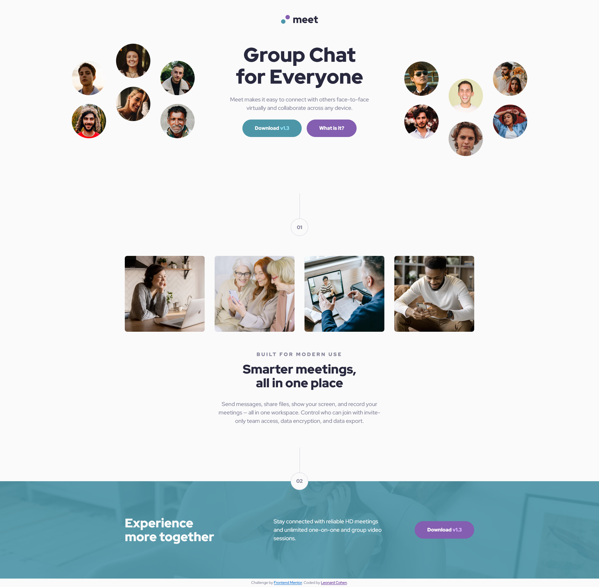

# Frontend Mentor - Meet landing page solution

This is a solution to the [Meet landing page challenge on Frontend Mentor](https://www.frontendmentor.io/challenges/meet-landing-page-rbTDS6OUR). Frontend Mentor challenges help you improve your coding skills by building realistic projects. 

## Table of contents

- [Overview](#overview)
  - [The challenge](#the-challenge)
  - [Screenshot](#screenshot)
  - [Links](#links)
- [My process](#my-process)
  - [Built with](#built-with)
  - [Continued development](#continued-development)
- [Author](#author)
- [Acknowledgments](#acknowledgments)

**Note: Delete this note and update the table of contents based on what sections you keep.**

## Overview

### The challenge

Users should be able to:

- View the optimal layout depending on their device's screen size
- See hover states for interactive elements

### Screenshot

### Links

- Solution URL: [https://github.com/lenny131/meet-landing-page](https://github.com/lenny131/meet-landing-page)
- Live Site URL: [https://lenny131.github.io/meet-landing-page/](https://lenny131.github.io/meet-landing-page/)

## My process

### Built with

- HTML and CSS
- Sass

### Continued development

I will be practicing Javascript and then plan on learning React.

## Author

- Website - [Leonard Cohen](https://leonardmcohen.com)
- Frontend Mentor - [@lenny131](https://www.frontendmentor.io/profile/lenny131)

## Acknowledgments

[Emmanuel Lopez](https://www.frontendmentor.io/profile/EmLopezDev) - Suggested using `em` instead of `rem` in media queries.

